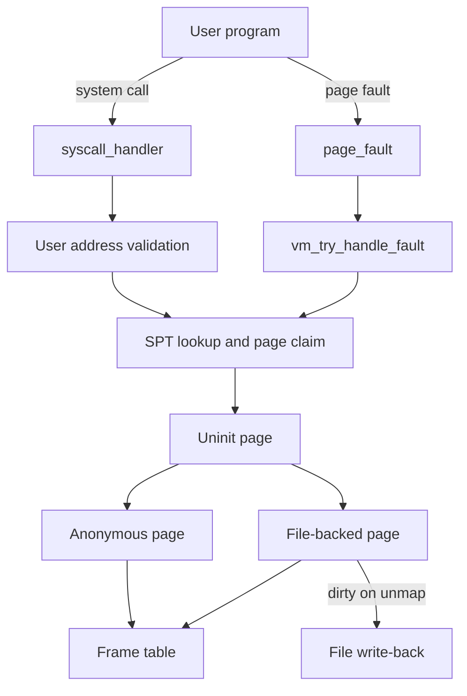

# Pintos: User Programs & Virtual Memory

> KAIST Pintos 기반 x86-64 교육용 운영체제에서 사용자 프로그램과 가상 메모리의 핵심 경로를 구현·디버깅한 프로젝트입니다.

| 구분 | 내용 |
| --- | --- |
| 기간 | 2026.04–2026.05 |
| 팀 구성 | 2주 단위 3인 팀 × 2회 운영, 총 5명 참여 |
| 주요 역할 | System call, SPT, lazy loading 구현·디버깅 |
| 기술 | C, x86-64, GDB, Git, Docker, QEMU |

## 프로젝트 개요

Pintos는 운영체제의 핵심 구조를 직접 구현하며 학습하는 교육용 커널입니다. 이 프로젝트에서는 KAIST Pintos의 기본 코드 위에 사용자 프로그램 실행에 필요한 system call과 프로세스 관리 기능을 연결하고, SPT lookup·lazy loading·stack growth·mmap으로 이어지는 가상 메모리 핵심 경로를 구현하고 디버깅했습니다.

다음 세 가지를 일관되게 유지하는 데 집중했습니다.

- user/kernel 경계에서 사용자 주소의 유효성을 일관된 기준으로 판단할 것
- page-aligned virtual address를 기준으로 SPT lookup 규칙을 고정할 것
- lazy page가 실제 frame을 얻는 시점과 metadata의 생명주기를 구분할 것

## 팀 구현 범위

### User Programs

| 기능 | 내용 |
| --- | --- |
| Argument passing | 명령행을 `argc`, `argv` 형태로 구성하고 x86-64 호출 규약에 맞게 user stack에 배치 |
| System calls | syscall dispatch와 파일·프로세스 관련 system call 처리 |
| User memory validation | kernel 주소, unmapped 주소, 쓰기 불가능한 page 접근을 구분해 비정상 사용자 프로세스를 종료 |
| Process lifecycle | `exec`, `fork`, `wait`, `exit` 흐름과 부모·자식 상태 및 실행 파일 생명주기 관리 |
| File descriptor | 프로세스별 fd table과 파일 접근 경로 관리 |

### Virtual Memory

| 기능 | 내용 |
| --- | --- |
| Supplemental Page Table | page-aligned user virtual address를 key로 page metadata 관리 |
| Lazy loading | 실행 파일과 mmap 영역을 즉시 읽지 않고 최초 접근 시 frame에 적재 |
| Page fault handling | SPT lookup, stack growth 판단, page claim을 하나의 fault 처리 흐름으로 연결 |
| Stack growth | fault 주소와 user stack pointer의 관계를 검증해 필요한 stack page만 확장 |
| SPT copy | `fork` 시 uninit·anonymous page의 복사 경로 구성 |
| mmap·munmap | file-backed page의 lazy load와 mmap-read·close·unmap 경로 구현 |

## 동작 구조



두 진입점은 서로 다르지만 최종적으로 같은 page metadata와 claim 경로를 사용합니다.

- system call은 사용자 buffer를 page 단위로 검증하고, 합법적인 lazy page라면 claim합니다.
- page fault는 SPT에 등록된 page인지 확인하고, 필요한 경우 stack growth 여부를 판단합니다.
- uninit page는 최초 claim 시 anonymous 또는 file-backed page로 전환됩니다.
- mmap으로 연결한 file-backed page는 해제할 때 변경된 내용을 파일에 반영합니다.

## 팀 문제 해결 사례

### 1. SPT의 key와 lazy page 상태 불변식 정리

- **문제:** SPT hash key가 가상 주소 값이 아니라 해당 주소가 가리키는 메모리처럼 해석되거나, uninit page의 현재 타입과 초기화 이후 타입을 혼동하면서 lookup 실패, 중복 삽입, null dereference가 서로 다른 위치에서 발생했습니다.
- **해결:** SPT의 key를 page-aligned user virtual address로 고정했습니다. hash miss는 `NULL`로 처리하고, uninit 상태와 최종 page 타입을 분리해 해석했습니다. lazy loading에 필요한 initializer와 metadata도 실제 page claim 시점까지 유지하도록 생명주기를 정리했습니다.
- **결과:** `virtual address → page metadata` lookup 규칙을 하나의 invariant로 정리했습니다. 관련 변경은 [VA 기준 hash key 수정](https://github.com/5giran/pintos/commit/41f62c59c5c6ccf0b19fee750ddc98f9e3046aa6)과 [lookup 실패 시 NULL 처리](https://github.com/5giran/pintos/commit/5398ca4c1bfe42e98503272715aa2e48af397e9f)에서 확인할 수 있습니다.

### 2. kernel-mode page fault에서 stack growth 판단 기준 분리

- **문제:** stack growth는 fault 주소가 현재 user stack pointer 근처인지 확인해야 합니다. 하지만 system call 처리 중 kernel mode에서 page fault가 발생하면 exception frame의 `rsp`를 user stack pointer로 신뢰할 수 없었습니다.
- **해결:** 팀은 system call 진입 시점의 user `rsp`를 thread 상태에 보존하고, user mode fault와 kernel mode fault가 각각 신뢰할 수 있는 stack pointer를 사용하도록 분기했습니다. stack growth 판단을 별도 조건으로 분리해 page fault 처리와 user buffer validation에서 재사용했습니다.
- **결과:** fault context에 따라 stack pointer를 선택하는 경로를 도입하고, 이후 [frame 이중 할당 문제](https://github.com/5giran/pintos/commit/b5691537095e6f28549274b1daf4ad8371966445)를 수정했습니다.

### 3. mmap·munmap의 file·page 생명주기 정리

- **문제:** mmap page가 원래 file descriptor의 file 객체에 의존하면 사용자가 fd를 닫은 뒤 lazy loading을 수행할 수 없습니다. 마지막 page의 read/zero 범위, dirty page write-back 길이, munmap 이후 SPT entry 제거 순서도 각각 오류의 원인이 됐습니다.
- **해결:** 팀은 mapping이 사용할 file reference를 독립적으로 유지하고, 각 page에 offset과 `read_bytes`, `zero_bytes`를 metadata로 저장했습니다. 해제 시에는 dirty 영역 write-back, page table과 SPT mapping 제거, file과 metadata 해제 순서를 기준으로 문제를 나눠 추적했습니다.
- **결과:** 관련 변경으로 [mmap-read·mmap-close](https://github.com/5giran/pintos/commit/8493a7e7e2f0ca472dd6974cdc430582f5f3cded), [mmap-unmap](https://github.com/5giran/pintos/commit/3a941cfb6848ea272f98635a457b3b5363094bfc), [partial page write-back 범위 제한](https://github.com/5giran/pintos/commit/b826dfb75cbeafa2eb41e5d7271fdb31ec945e11)을 확인할 수 있습니다.

## 협업과 역할

2주마다 팀 구성이 바뀌는 동안 기능 담당을 나누되, 핵심 설계와 구현·디버깅은 함께 진행했습니다.

- **중점 영역:** system call, user memory validation, SPT lookup·삽입, lazy loading metadata
- **공동 작업:** stack growth와 mmap·munmap의 설계·구현·디버깅
- **협업 방식:** 설계 논의, 공동 구현, code review, 테스트 결과 분석

## 실행 방법

### 1. 개발 환경 열기

Docker Desktop과 VS Code Dev Containers 확장을 설치한 뒤 저장소를 DevContainer로 엽니다. 자세한 내용은 [개발 환경 설정](docs/setup.md)을 참고하세요.

### 2. Pintos 환경 활성화

```bash
cd pintos
source ./activate
```

### 3. 빌드 및 테스트

```bash
cd vm
make

# Project 2 회귀 테스트
make p2-nofork-check
make p2-fork-check

# Project 3 page table·stack 테스트
make p3-pt-check

# mmap 테스트
make p3-mmap-check
```

테스트 결과는 `pintos/vm/build/results`와 각 테스트의 `.result`, `.output`, `.errors` 파일에서 확인할 수 있습니다.

## 저장소 구조

```text
.
├── .devcontainer/        # Ubuntu 22.04 기반 개발 환경
├── docs/                 # 프로젝트 기록과 환경 문서
└── pintos/
    ├── threads/          # thread와 scheduler 기반 코드
    ├── userprog/         # process, syscall, exception 처리
    ├── vm/               # SPT, page, frame, file-backed memory
    ├── filesys/          # Pintos file system
    └── tests/
        ├── userprog/     # Project 2 테스트
        └── vm/           # Project 3 테스트
```

주요 구현 파일은 다음과 같습니다.

- [`pintos/userprog/process.c`](pintos/userprog/process.c): process 생성·복제·종료와 executable lazy loading
- [`pintos/userprog/syscall.c`](pintos/userprog/syscall.c): syscall dispatch와 user memory validation
- [`pintos/userprog/exception.c`](pintos/userprog/exception.c): page fault 진입점
- [`pintos/vm/vm.c`](pintos/vm/vm.c): SPT, frame, page claim, stack growth
- [`pintos/vm/anon.c`](pintos/vm/anon.c): anonymous page 관리
- [`pintos/vm/file.c`](pintos/vm/file.c): file-backed page와 mmap·munmap

## 참고 자료

- [KAIST Pintos documentation](https://casys-kaist.github.io/pintos-kaist/)
- [Pintos source notice](pintos/README.md)
- [License](pintos/LICENSE)
