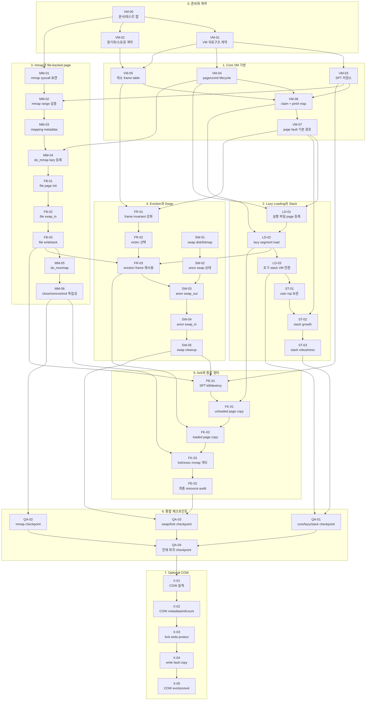

# Project 3 VM 작업 티켓 DAG

## 목적

이 문서는 3인이 Project 3 Virtual Memory를 진행할 때 사람별 소유자가 아니라 작업 티켓 단위로 일을 가져갈 수 있도록 쪼갠 것이다. 각 티켓은 선행 티켓이 모두 완료되면 누구든 가져갈 수 있다.

이전의 사람별 배치 방식은 제외한다. 여기서는 `VM-*`, `LD-*`, `ST-*`, `MM-*`, `FB-*`, `FR-*`, `SW-*`, `FK-*`, `PE-*`, `QA-*` 티켓만 사용한다.

## 기준 자료

Pintos 구현 요구사항 판단은 아래 로컬 자료를 기준으로 한다.

- `pintos/docs/pintos-kaist-ko/project3/introduction.html`
- `pintos/docs/pintos-kaist-ko/project3/vm_management.html`
- `pintos/docs/pintos-kaist-ko/project3/anon.html`
- `pintos/docs/pintos-kaist-ko/project3/stack_growth.html`
- `pintos/docs/pintos-kaist-ko/project3/memory_mapped_files.html`
- `pintos/docs/pintos-kaist-ko/project3/swapping.html`
- `pintos/docs/pintos-kaist-ko/project3/cow.html`
- `pintos/tests/vm/Make.tests`
- `pintos/tests/vm/Rubric.functionality`
- `pintos/tests/vm/Rubric.robustness`
- `pintos/tests/vm/Grading`
- `pintos/tests/vm/cow/Make.tests`

관련 테스트는 티켓 완료 검증의 기준이다. 이 문서는 테스트를 직접 실행한 결과가 아니라, 테스트 파일과 Rubric을 기준으로 한 작업 분할이다.

## 티켓 운영 규칙

- 선행 티켓이 모두 완료된 티켓만 가져간다.
- 한 티켓은 가능하면 한 PR 또는 한 issue로 끝낼 수 있는 크기로 둔다.
- 한 파일을 동시에 건드리는 티켓은 선행 계약 티켓을 먼저 완료한 뒤 진행한다.
- `vm/vm.c`, `include/vm/vm.h`, `userprog/process.c`, `userprog/syscall.c`는 충돌이 잦으므로 티켓 본문에 적힌 범위 밖의 리팩터링은 별도 티켓으로 분리한다.
- Optional COW는 기본 VM 티켓과 분리한다. 기본 Project 3 통과 전에 COW를 섞으면 fork, eviction, write-protection 디버깅 범위가 불필요하게 커진다.

## 전체 DAG

## 티켓 상세

### VM-00. 문서와 테스트 맵 정리

- 선행: 없음
- 목표: Project 3 문서와 `tests/vm` 테스트를 기능 영역별로 묶는다.
- 범위: Project 3 문서의 SPT, frame table, swap table, stack growth, mmap, swapping, COW extra 요구사항을 요약한다.
- 완료 조건: 테스트가 `core`, `lazy`, `stack`, `mmap`, `swap`, `fork/exit`, `cow-extra`로 분류되어 있고, 각 분류가 어떤 문서 절과 연결되는지 정리되어 있다.
- 관련 테스트: `pintos/tests/vm/Make.tests`, `Rubric.functionality`, `Rubric.robustness`, `Grading`
- 주의: 외부 Pintos 해설이나 GitHub 구현을 근거로 삼지 않는다.

### VM-01. VM 자료구조 계약

- 선행: VM-00
- 목표: 구현 전에 page, SPT, frame, swap, file-backed metadata의 최소 필드와 책임을 정한다.
- 범위: `struct page`, type별 union, `struct supplemental_page_table`, `struct frame`, `struct anon_page`, `struct file_page`에 어떤 정보를 둘지 설계한다.
- 완료 조건: 각 자료구조의 owner, lifetime, lookup key, 중복 삽입 처리, destroy 책임이 문서화되어 있다.
- 관련 테스트: 전체 VM 테스트의 공통 기반
- 주의: 실제 구현 코드가 아니라 팀 계약 티켓이다. 이 계약 없이 하위 티켓을 병렬로 진행하면 merge conflict보다 의미 충돌이 더 커진다.

### VM-02. 동기화와 소유권 계약

- 선행: VM-00
- 목표: frame table, swap bitmap, file system 접근, SPT destroy 중 lock 순서를 정한다.
- 범위: 전역 frame table lock, swap table lock, file operation lock 사용 여부, page/frame 역참조 갱신 순서를 정한다.
- 완료 조건: deadlock을 피하기 위한 lock 획득 순서와 예외 상황의 rollback 책임이 정리되어 있다.
- 관련 테스트: `page-parallel`, `page-merge-par`, `swap-fork`, `mmap-shuffle`
- 주의: 병렬 테스트는 기능이 맞아도 lock 순서가 흔들리면 재현 어려운 실패를 만든다.

### VM-03. SPT 저장소 구현

- 선행: VM-01
- 목표: process별 supplemental page table의 저장소와 기본 연산을 완성한다.
- 범위: `supplemental_page_table_init`, `spt_find_page`, `spt_insert_page`, `spt_remove_page`의 자료구조 정책.
- 완료 조건: page-aligned user virtual address를 key로 중복 없이 insert/find/remove가 가능하다.
- 관련 테스트: `pt-bad-addr`, `mmap-overlap`, `mmap-over-code`, `mmap-over-data`, `mmap-over-stk`
- 주의: `spt_find_page`는 fault address가 page 내부 주소여도 같은 page를 찾아야 한다.

### VM-04. page allocation과 uninit lifecycle

- 선행: VM-01
- 목표: 모든 lazy page가 `VM_UNINIT`으로 태어나고 첫 fault에서 실제 타입으로 변환되는 경로를 만든다.
- 범위: `vm_alloc_page_with_initializer`, `uninit_new`, `uninit_destroy`, type별 initializer 선택 계약.
- 완료 조건: `VM_ANON`, `VM_FILE` 후보 page를 SPT에 등록할 수 있고, 아직 frame은 할당하지 않는다.
- 관련 테스트: `lazy-anon`, `lazy-file`, `page-linear`
- 주의: aux 메모리의 해제 책임을 명확히 하지 않으면 exit 전 한 번도 접근하지 않은 page에서 누수가 난다.

### VM-05. 최소 frame table과 PAL_USER 할당

- 선행: VM-01, VM-02
- 목표: eviction 없이도 frame을 추적하는 최소 frame table을 만든다.
- 범위: `vm_get_frame`의 `PAL_USER` 기반 할당, `struct frame` 관리, frame list 등록, 초기 lock.
- 완료 조건: 새 frame은 `kva`를 가지고 `page == NULL` 상태로 반환되며 frame table에서 추적된다.
- 관련 테스트: `page-linear`, `lazy-anon`
- 주의: Project 3 FAQ는 user page frame을 `PAL_USER` pool에서 할당해야 한다고 설명한다.

### VM-06. page claim과 pml4 mapping

- 선행: VM-03, VM-04, VM-05
- 목표: SPT에 등록된 page를 실제 frame에 올리고 CPU page table에 연결한다.
- 범위: `vm_claim_page`, `vm_do_claim_page`, pml4 mapping, page/frame 역참조, `swap_in` 호출 순서.
- 완료 조건: claim 성공 시 `page->frame`, `frame->page`, pml4 mapping이 서로 일관되고 `swap_in`이 호출된다.
- 관련 테스트: `lazy-anon`, `page-linear`, `pt-bad-read`
- 주의: mapping 실패 시 frame/page 역참조와 frame table 상태를 되돌릴 수 있어야 한다.

### VM-07. page fault 기본 경로

- 선행: VM-06
- 목표: page fault를 무조건 kill하지 않고 SPT 기반 lazy load 요청으로 처리한다.
- 범위: `vm_try_handle_fault`의 invalid access 검증, `not_present`, `write`, `user`, kernel address 처리, SPT lookup, claim dispatch.
- 완료 조건: 유효한 lazy page fault는 claim되고, write-protected page나 kernel/user 범위 오류는 실패한다.
- 관련 테스트: `pt-bad-addr`, `pt-bad-read`, `pt-write-code`, `pt-write-code2`, `lazy-anon`
- 주의: stack growth는 아직 별도 티켓이다. 이 티켓에서는 SPT에 이미 존재하는 page만 처리한다.

### LD-01. 실행 파일 page의 lazy 등록

- 선행: VM-04, VM-07
- 목표: executable segment를 load 시점에 즉시 읽지 않고 page metadata만 등록한다.
- 범위: `load_segment`가 file offset, read bytes, zero bytes, writable 정보를 page 단위 aux로 저장하는 흐름.
- 완료 조건: ELF segment page가 SPT에 lazy page로 등록되고, load 시점에 user frame을 선점하지 않는다.
- 관련 테스트: `lazy-anon`, `page-linear`, 기존 userprog 실행 테스트
- 주의: executable file lifetime이 lazy fault 시점까지 유효해야 한다.

### LD-02. lazy segment load와 zero-fill

- 선행: LD-01, VM-06
- 목표: 첫 접근 시 executable segment 내용을 읽고 남은 영역을 0으로 채운다.
- 범위: `lazy_load_segment`에서 read/zero 영역 처리, 실패 시 자원 정리, aux 소비 규칙.
- 완료 조건: BSS/zero 영역과 file-backed executable 영역이 접근 시점에 올바른 내용으로 채워진다.
- 관련 테스트: `lazy-anon`, `page-linear`, `page-shuffle`
- 주의: 이 티켓의 `file-backed`는 mmap의 `VM_FILE`과 다를 수 있다. 실행 파일 segment lazy load와 mmap file page를 섞어 설계하지 않도록 한다.

### LD-03. 초기 stack page의 VM 전환

- 선행: LD-02
- 목표: Project 2의 한 페이지 stack setup을 Project 3 VM 경로와 충돌하지 않게 맞춘다.
- 범위: `setup_stack`, initial stack page 등록/claim, `if_->rsp = USER_STACK`, argument passing과의 관계 확인.
- 완료 조건: 초기 user stack이 SPT와 pml4에 일관되게 존재하고, 기존 argument passing이 깨지지 않는다.
- 관련 테스트: 기존 userprog argument/process tests, `pt-grow-stack`의 선행 상태
- 주의: stack growth는 아직 하지 않는다. 초기 stack 한 페이지가 안정적으로 올라오는 것이 목표다.

### ST-01. user rsp 보존 경로

- 선행: LD-03
- 목표: stack growth 판정에 사용할 user stack pointer를 안정적으로 얻는다.
- 범위: syscall entry/handler에서 user `rsp`를 thread 상태에 저장할지, page fault `intr_frame`에서 바로 쓸지 정책을 정리하고 반영한다.
- 완료 조건: user mode fault와 syscall 중 kernel mode fault에서 사용할 기준 `rsp`가 명확하다.
- 관련 테스트: `pt-grow-stk-sc`, user memory pointer 관련 userprog 회귀
- 주의: Project 3 stack growth 문서는 kernel mode에서 발생한 page fault의 `intr_frame.rsp`가 user rsp가 아닐 수 있음을 경고한다.

### ST-02. stack growth 구현

- 선행: ST-01, VM-07
- 목표: SPT에 없는 fault 중 합법적인 stack 확장만 anonymous page 할당으로 처리한다.
- 범위: `vm_try_handle_fault`의 stack 판정, `vm_stack_growth`, 1MB 제한, `rsp - 8` 근처 push 허용 정책.
- 완료 조건: fault address를 page boundary로 내림 정렬해 필요한 stack page를 만들고 claim한다.
- 관련 테스트: `pt-grow-stack`, `pt-grow-stk-sc`, `pt-big-stk-obj`
- 주의: 모든 낮은 주소 접근을 stack growth로 인정하면 `pt-grow-bad`와 mmap overlap 계열이 깨진다.

### ST-03. stack robustness 정리

- 선행: ST-02
- 목표: stack growth 성공 케이스와 실패 케이스의 경계를 점검한다.
- 범위: 1MB 초과, kernel address, 너무 먼 address, read/write 조건, stack과 mmap overlap 관계.
- 완료 조건: stack 관련 robustness 실패 조건이 문서 기준으로 정리되고 구현 경계가 일관된다.
- 관련 테스트: `pt-grow-bad`, `mmap-over-stk`, `page-merge-stk`
- 주의: 이 티켓은 기능 추가보다 경계 조건 검토 성격이 강하다.

### MM-01. mmap syscall 표면 연결

- 선행: VM-00
- 목표: syscall layer에서 `mmap`, `munmap` 요청을 VM layer로 넘기는 표면을 만든다.
- 범위: syscall number dispatch, argument 추출, fd lookup, `do_mmap`, `do_munmap` 호출 경계.
- 완료 조건: fd 0/1, 존재하지 않는 fd, 닫힌 fd 같은 명백한 실패를 syscall 계층에서 구분할 수 있다.
- 관련 테스트: `mmap-bad-fd`, `mmap-bad-fd2`, `mmap-bad-fd3`
- 주의: 실제 page 등록은 MM-04 이후다. 이 티켓에서는 syscall 표면과 fd 검증 경계를 잡는다.

### MM-02. mmap range 검증

- 선행: VM-03, MM-01
- 목표: mmap 요청 주소 범위가 합법적인지 SPT 기준으로 판정한다.
- 범위: `addr == NULL`, page alignment, `length == 0`, file length 0, kernel address, offset alignment, 기존 page와 overlap, stack/code/data 영역 overlap.
- 완료 조건: 실패해야 하는 mmap 요청이 page를 등록하지 않고 실패한다.
- 관련 테스트: `mmap-null`, `mmap-zero`, `mmap-zero-len`, `mmap-misalign`, `mmap-over-code`, `mmap-over-data`, `mmap-over-stk`, `mmap-overlap`, `mmap-bad-off`, `mmap-kernel`
- 주의: `mmap-zero.c`는 zero-length file mmap 자체보다 이후 접근이 unmapped로 죽는지를 본다. 실패 처리 후 page가 남지 않아야 한다.

### MM-03. mapping metadata와 lifetime 모델

- 선행: MM-02
- 목표: `munmap(addr)`가 같은 mapping 범위를 찾을 수 있는 메타데이터 모델을 정한다.
- 범위: page별 length/offset 저장 방식, mapping 단위 목록을 둘지 여부, 시작 주소 검증, mapping별 reopened file 소유권.
- 완료 조건: explicit munmap, process exit, partial last page writeback이 같은 metadata로 처리 가능하다.
- 관련 테스트: `mmap-unmap`, `mmap-exit`, `mmap-clean`, `mmap-close`, `mmap-remove`
- 주의: mapping metadata 없이 page만 흩어두면 `munmap`이 어느 범위까지 지워야 하는지 애매해진다.

### MM-04. do_mmap lazy page 등록

- 선행: MM-03, VM-04
- 목표: mmap 호출 시 파일 내용을 즉시 읽지 않고 `VM_FILE` lazy page를 SPT에 등록한다.
- 범위: file length와 requested length에 따른 page 수 계산, page별 read bytes/zero bytes/offset/writable 저장.
- 완료 조건: mmap 성공 직후에는 page metadata만 존재하고, 접근 전 물리 frame은 없어야 한다.
- 관련 테스트: `lazy-file`, `mmap-read`, `mmap-off`
- 주의: `mmap-off.c`는 page-aligned nonzero offset이 정상 동작해야 함을 확인한다.

### FB-01. file-backed page initializer

- 선행: MM-04
- 목표: `VM_FILE` page가 첫 fault에서 file-backed operations로 전환되게 한다.
- 범위: `file_backed_initializer`, `struct file_page` metadata 이전, writable flag와 backing file reference 유지.
- 완료 조건: `VM_UNINIT -> VM_FILE` 전환 후 `swap_in`, `swap_out`, `destroy`가 file operations를 사용한다.
- 관련 테스트: `lazy-file`, `mmap-read`
- 주의: initializer에서 aux를 page 내부 metadata로 옮긴 뒤 aux lifetime을 명확히 해야 한다.

### FB-02. file-backed swap_in

- 선행: FB-01
- 목표: mmap page fault 시 파일에서 내용을 읽고 page 나머지를 0으로 채운다.
- 범위: file offset read, short read 처리, last page zero-fill, readonly mapping의 내용 확인.
- 완료 조건: mmap된 주소를 읽으면 파일 내용과 zero-fill 영역이 문서대로 보인다.
- 관련 테스트: `mmap-read`, `mmap-ro`, `mmap-shuffle`, `lazy-file`
- 주의: read 경로는 file system 동기화 정책과 충돌하지 않아야 한다.

### FB-03. file-backed dirty writeback

- 선행: FB-02
- 목표: dirty인 mmap page만 파일에 반영하고, clean page는 불필요하게 쓰지 않는다.
- 범위: `file_backed_swap_out`, `file_backed_destroy`, dirty bit 확인, partial last page writeback 범위.
- 완료 조건: writeback이 필요한 page만 파일에 쓰이고, writeback 후 dirty 상태가 정리된다.
- 관련 테스트: `mmap-write`, `mmap-clean`, `mmap-ro`, `swap-file`
- 주의: mmap 문서는 mapping 해제와 process exit 때 쓴 page만 파일에 기록해야 한다고 설명한다.

### MM-05. do_munmap 구현

- 선행: FB-03
- 목표: `munmap(addr)`가 해당 mapping 범위를 해제하고 필요한 writeback을 수행한다.
- 범위: mapping 시작 주소 검증, 범위 순회, SPT 제거, pml4 mapping 제거, frame detach, file reference 해제.
- 완료 조건: explicit munmap 후 같은 주소 접근은 invalid가 되고, dirty 변경은 파일에 반영된다.
- 관련 테스트: `mmap-unmap`, `mmap-write`, `mmap-twice`
- 주의: `munmap`과 `spt_remove_page`/`vm_dealloc_page`의 책임 경계를 PE-01과 맞춰야 한다.

### MM-06. mmap close/remove/exit 독립성

- 선행: MM-05
- 목표: file descriptor close/remove와 mapping lifetime이 독립적으로 유지되게 한다.
- 범위: `file_reopen` 기준 file reference, close 후 접근, remove 후 접근, process exit에서 implicit unmap과의 연결.
- 완료 조건: close/remove 이후에도 기존 mapping은 munmap 또는 exit까지 유효하다.
- 관련 테스트: `mmap-close`, `mmap-remove`, `mmap-exit`
- 주의: process exit 전체 정리는 PE-01에서 다루지만, 이 티켓에서 mmap 쪽 요구사항을 먼저 만족시켜야 한다.

### FR-01. frame invariant 강화

- 선행: VM-05, VM-07
- 목표: eviction을 붙이기 전에 frame table의 불변식을 명확히 한다.
- 범위: frame list 순회 안전성, frame lock, `frame->page`, `page->frame`, pml4 mapping의 동기화 지점.
- 완료 조건: frame이 어느 page를 담는지 전역적으로 추적되고, claim 실패/해제 시 일관성이 깨지지 않는다.
- 관련 테스트: `page-parallel`, `page-linear`
- 주의: eviction 전 단계에서 불변식이 흔들리면 victim 선택 이후 원인 파악이 어렵다.

### FR-02. victim 선택 정책

- 선행: FR-01
- 목표: frame 부족 시 쫓아낼 frame을 선택하는 정책을 구현한다.
- 범위: clock 또는 second-chance 정책, accessed bit 확인/초기화, pinned page가 필요하다면 정책 정의.
- 완료 조건: frame table에서 eviction 가능한 victim을 반환하고, 최근 접근 page를 무조건 먼저 쫓아내지 않는다.
- 관련 테스트: `page-shuffle`, `page-merge-seq`, `page-merge-par`
- 주의: accessed/dirty bit는 user va와 kernel alias 문제를 고려해야 한다.

### FR-03. eviction orchestration과 frame 재사용

- 선행: FR-02, FB-03, LD-02
- 목표: victim 선택 이후 pml4 mapping 제거, type별 `swap_out` 호출, frame 재사용까지의 공통 흐름을 만든다.
- 범위: victim pml4 mapping 제거, `swap_out` 호출, old page/frame detach, reused frame 상태 초기화.
- 완료 조건: `palloc_get_page(PAL_USER)` 실패 시 victim 선택과 공통 eviction 흐름으로 진입할 수 있다.
- 관련 테스트: `page-shuffle`, `page-merge-par`, `page-merge-mm`, `swap-file`
- 주의: anonymous page의 실제 disk write는 SW-03에서 완성된다. 이 티켓은 `swap_out`을 호출할 공통 뼈대를 제공하고, 타입별 저장 정책은 FB-03과 SW-03에 의존한다.

### SW-01. swap disk와 bitmap 초기화

- 선행: VM-02
- 목표: anonymous page eviction에 사용할 swap table을 초기화한다.
- 범위: swap disk 획득, page-size slot 계산, free/used bitmap, lock.
- 완료 조건: swap slot을 lazy allocation할 수 있는 전역 구조가 준비된다.
- 관련 테스트: `swap-anon`, `swap-iter`, `swap-fork`
- 주의: Project 3 문서는 swap slot을 page 생성 시 미리 예약하지 말고 eviction 때만 잡으라고 설명한다.

### SW-02. anonymous page swap 상태

- 선행: SW-01
- 목표: anonymous page가 swap slot 위치와 in-memory/out 상태를 표현할 수 있게 한다.
- 범위: `struct anon_page`, `anon_initializer`, initial zero state, swapped state marker.
- 완료 조건: anonymous page가 아직 swap된 적 없는 상태와 특정 swap slot에 나가 있는 상태를 구분한다.
- 관련 테스트: `lazy-anon`, `swap-anon`
- 주의: stack page와 executable lazy anonymous page 모두 이 경로를 공유할 수 있다.

### SW-03. anon_swap_out

- 선행: FR-03, SW-02
- 목표: anonymous page 내용을 swap disk slot에 기록하고 frame을 비울 수 있게 한다.
- 범위: free slot 할당, page-size write, slot index 저장, swap full panic 정책.
- 완료 조건: anonymous victim page가 memory에서 제거되어도 backing store 위치를 page metadata에 보존한다.
- 관련 테스트: `swap-anon`, `swap-iter`, `page-merge-stk`
- 주의: swap out 후 pml4 mapping 제거와 dirty/accessed 정리는 FR-03 계약과 맞아야 한다.

### SW-04. anon_swap_in

- 선행: SW-03
- 목표: swap out된 anonymous page를 fault 시 원래 내용으로 복원한다.
- 범위: slot read, frame에 복원, bitmap slot 해제, page swap 상태 초기화.
- 완료 조건: swap out된 page를 다시 읽으면 기존 데이터가 유지되고 slot이 재사용 가능해진다.
- 관련 테스트: `swap-anon`, `swap-iter`, `swap-fork`
- 주의: swap in 성공 후 slot을 해제하지 않으면 장기 테스트에서 swap full로 이어진다.

### SW-05. swap cleanup과 실패 처리

- 선행: SW-04
- 목표: process exit 또는 page destroy 시 swap slot과 frame 자원이 누수되지 않게 한다.
- 범위: swapped-out anon page destroy, failed swap_in/out rollback, swap bitmap 해제.
- 완료 조건: loaded page, swapped page, never-loaded page 모두 destroy 경로가 명확하다.
- 관련 테스트: `swap-iter`, `swap-fork`, 전체 VM 장기 테스트
- 주의: PE-01의 SPT kill이 이 destroy 계약에 의존한다.

### PE-01. SPT kill과 page destruction

- 선행: VM-03, FB-03, SW-05
- 목표: process exit에서 SPT가 가진 모든 page 자원을 정리한다.
- 범위: `supplemental_page_table_kill`, page 순회, type별 destroy, dirty mmap writeback, swap slot 반환.
- 완료 조건: process exit 시 page, frame, reopened file, swap slot이 정리된다.
- 관련 테스트: `mmap-exit`, `swap-fork`, 기존 process exit tests
- 주의: 한 번도 fault되지 않은 `VM_UNINIT` page도 destroy 대상이다.

### FK-01. unloaded page 복사

- 선행: PE-01, LD-02
- 목표: fork 시 아직 load되지 않은 SPT entry를 자식에게 복사한다.
- 범위: `supplemental_page_table_copy`에서 `VM_UNINIT` page의 initializer, aux, writable, file reference deep copy 정책.
- 완료 조건: 부모가 아직 접근하지 않은 page도 자식에서 접근하면 독립적으로 lazy load된다.
- 관련 테스트: `page-parallel`, `swap-fork`의 선행 조건
- 주의: aux를 shallow copy하면 부모/자식 중 한쪽 destroy가 다른 쪽 metadata를 깨뜨릴 수 있다.

### FK-02. loaded page 복사

- 선행: FK-01, FR-03
- 목표: fork 시 이미 frame에 올라온 page 내용을 자식에게 복제한다.
- 범위: loaded anonymous/file-backed page copy, writable bit 유지, 자식 pml4 mapping, 실패 rollback.
- 완료 조건: fork 후 부모와 자식이 같은 virtual address의 내용을 독립적으로 가진다.
- 관련 테스트: `page-parallel`, `page-merge-par`, `swap-fork`, 기존 `fork-*` userprog tests
- 주의: 기본 Project 3에서는 COW가 아니라 실제 복사를 기준으로 두는 편이 단순하다.

### FK-03. fork/exec mmap 격리

- 선행: MM-06, FK-02
- 목표: mmap 관련 fork/exec 테스트에서 parent mapping과 child address space가 섞이지 않게 한다.
- 범위: fork 시 mmap page copy 정책, exec 시 기존 SPT 정리, child process mapping isolation.
- 완료 조건: child가 parent mmap을 부정확하게 물려받아 접근 가능한 상태가 되지 않는다.
- 관련 테스트: `mmap-inherit`, `mmap-exit`, 기존 exec/fork tests
- 주의: `mmap-inherit.c`는 child가 `exec("child-inherit")` 이후 parent mapping을 볼 수 없어야 함을 확인한다.

### PE-02. 최종 resource audit

- 선행: FK-03
- 목표: fork, exec, exit, munmap, eviction, swap이 같은 destroy 규칙을 공유하는지 점검한다.
- 범위: page/frame/pml4/SPT/file/swap slot의 모든 생성/해제 경로 표 작성과 누락 수정.
- 완료 조건: 각 resource에 owner가 하나 있고, 성공/실패/exit 모든 경로에서 해제 책임이 명확하다.
- 관련 테스트: `swap-fork`, `mmap-exit`, `mmap-remove`, 전체 VM regression
- 주의: 이 티켓은 마지막 안정화 티켓이다. 기능 추가보다 누수, double free, stale mapping 제거에 집중한다.

## 통합 체크포인트 티켓

### QA-01. core/lazy/stack checkpoint

- 선행: ST-03, LD-03
- 목표: SPT, page fault, executable lazy loading, stack growth가 한 묶음으로 동작하는지 확인한다.
- 관련 테스트: `lazy-anon`, `page-linear`, `page-shuffle`, `pt-grow-stack`, `pt-grow-stk-sc`, `pt-big-stk-obj`, `pt-grow-bad`, page table robustness 묶음
- 완료 조건: 실패 시 어느 티켓 영역으로 되돌릴지 분류표가 작성되어 있다.

### QA-02. mmap checkpoint

- 선행: MM-06
- 목표: mmap 성공 경로와 실패 경로를 한 번에 점검한다.
- 관련 테스트: `lazy-file`, `mmap-read`, `mmap-write`, `mmap-ro`, `mmap-shuffle`, `mmap-twice`, `mmap-unmap`, `mmap-exit`, `mmap-clean`, `mmap-close`, `mmap-remove`, `mmap-off`, mmap robustness 묶음
- 완료 조건: mmap 관련 실패가 validation, lazy load, writeback, lifetime 중 어느 범주인지 분류되어 있다.

### QA-03. swap/fork checkpoint

- 선행: PE-02, SW-05
- 목표: 메모리 부족, eviction, swap, fork가 결합된 테스트를 점검한다.
- 관련 테스트: `swap-anon`, `swap-file`, `swap-iter`, `swap-fork`, `page-parallel`, `page-merge-seq`, `page-merge-par`, `page-merge-mm`, `page-merge-stk`, `mmap-inherit`
- 완료 조건: nondeterministic 실패가 생기면 lock, victim 선택, copy/destroy 중 어느 영역인지 추적 가능한 로그/분석 기준이 있다.

### QA-04. 전체 회귀 checkpoint

- 선행: QA-01, QA-02, QA-03
- 목표: Project 3가 이전 프로젝트 기능을 깨지 않았는지 최종 확인한다.
- 관련 테스트: `pintos/tests/vm/Grading` 기준 threads, userprog, VM functionality, VM robustness, filesys base
- 완료 조건: Project 3 범위의 남은 실패를 기능 결함, robustness 결함, 기존 과제 회귀, 환경 문제로 분류한다.

## 테스트 묶음별 역추적

| 테스트 묶음 | 먼저 봐야 할 티켓 |
| --- | --- |
| `lazy-anon` | VM-04, VM-06, VM-07, LD-01, LD-02 |
| `lazy-file` | MM-04, FB-01, FB-02 |
| `pt-grow-*`, `pt-big-stk-obj` | LD-03, ST-01, ST-02, ST-03 |
| `pt-bad-*`, `pt-write-code*` | VM-03, VM-06, VM-07 |
| `page-linear`, `page-shuffle` | VM-05, VM-06, LD-02, FR-01 이후 |
| `page-parallel`, `page-merge-par` | VM-02, FR-01, FR-02, FR-03, FK-02 |
| `page-merge-stk` | ST-02, FR-03, SW-03 |
| `page-merge-mm` | MM-04, FB-03, FR-03 |
| `mmap-read`, `mmap-off` | MM-04, FB-01, FB-02 |
| `mmap-write`, `mmap-clean`, `mmap-ro` | FB-03, MM-05 |
| `mmap-close`, `mmap-remove`, `mmap-exit` | MM-06, PE-01 |
| mmap robustness 전체 | MM-01, MM-02, MM-03 |
| `swap-anon`, `swap-iter` | FR-03, SW-01, SW-02, SW-03, SW-04 |
| `swap-file` | FB-03, FR-03 |
| `swap-fork` | SW-04, SW-05, FK-01, FK-02, PE-02 |
| `mmap-inherit` | MM-06, FK-03 |

## Optional COW 티켓

Copy-on-Write는 `pintos/docs/pintos-kaist-ko/project3/cow.html`과 `pintos/tests/vm/cow` 기준의 extra 작업이다. 기본 Project 3 티켓이 안정화된 뒤 진행한다.

### X-01. COW 설계

- 선행: QA-04
- 목표: 기본 fork copy 방식에서 COW 방식으로 바꿀 범위를 정한다.
- 범위: refcount, write-protect, page/frame 공유, file-backed page 공유, eviction 후보 정책.
- 관련 테스트: `cow-simple`, hidden COW tests

### X-02. COW metadata/refcount

- 선행: X-01
- 목표: shared frame의 참조 수와 page별 writable 원래 권한을 표현한다.
- 관련 테스트: `cow-simple`

### X-03. fork write-protect

- 선행: X-02
- 목표: fork 시 부모/자식이 같은 frame을 공유하되 PTE를 writable하지 않게 만든다.
- 관련 테스트: `cow-simple`

### X-04. write fault copy

- 선행: X-03
- 목표: write-protected COW page에 write fault가 나면 새 frame을 만들고 내용을 복사한다.
- 관련 테스트: `cow-simple`

### X-05. COW eviction/exit 통합

- 선행: X-04
- 목표: COW shared frame이 eviction, swap, process exit에서 refcount와 일관되게 정리되게 한다.
- 관련 테스트: `cow-simple`, hidden COW tests
